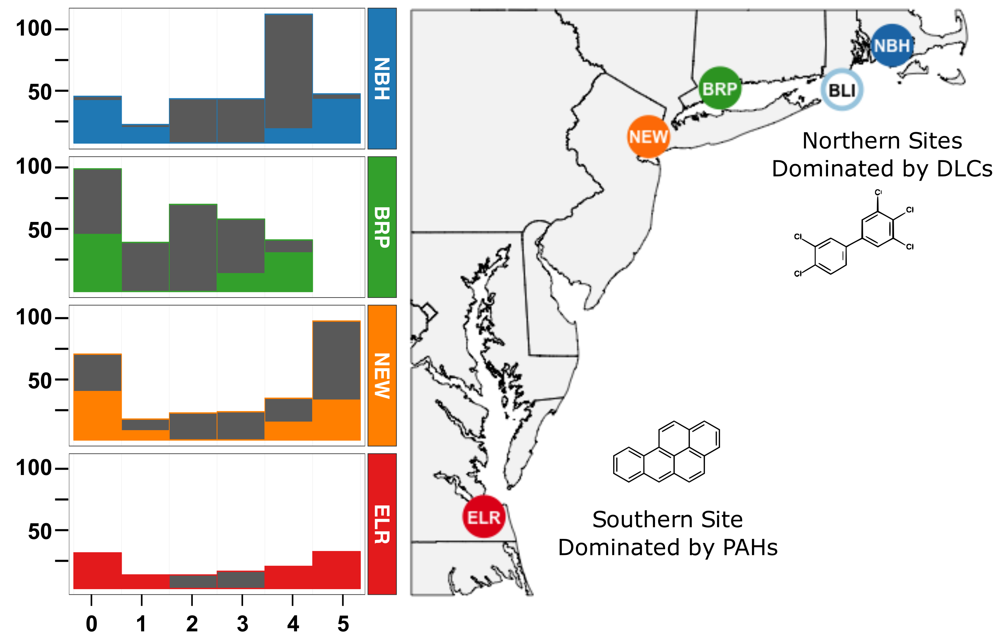
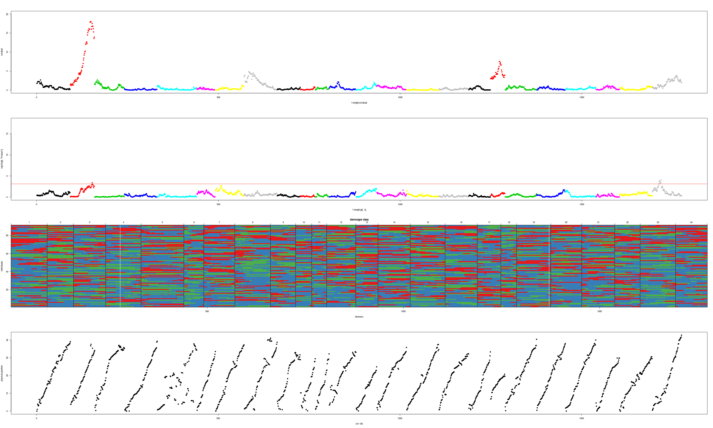

# Methods Summary

- The summary should be at least three pages in length excluding references.
- Support your statements with references to publications and links to code repositories in GitHub/Bioconductor/CRAN
- By Nov 22nd

### Background :
We used balanced selective genotyping (or two-tail genotyping) (Lebowitz et al. 1987; Lander and Botstein 1989), where we selected ~48 individuals from each of the most sensitive and most resistant ends of the phenotypic distribution for each family. 

In addition to genome-wide genotyping with RAD-seq, we also sought to confirm genotypes at two discrete loci: at the loci that encode aryl hydrocarbon receptor 2a/1a (AHR2a/1a) and aryl hydrocarbon receptor interacting protein (AIP). These loci encode proteins that are core components of the signaling pathway that is adaptively de-sensitized in resistant fish (Whitehead et al. 2012), and that show among the strongest signatures of natural selection in resistant populations (Reid et al. 2016). Since the adaptive haplotypes are not fixed in resistant populations (Reid et al. 2016), we sought to confirm whether adaptive haplotypes were segragating in our mapping families. We genotyped all ELR offspring for a deletion that spans the last exon of AHR2a and the first six exons of neighboring AHR1a (83 kb deletion) which exists at 81% frequency in wild ELR fish but is absent in sensitive fish from a nearby reference population (methods described in (Reid et al. 2016)). 

### Genotyping: 

I used RAD-seq (Miller et al. 2007) for genotyping these individuals from F2 intercross families and mapping family founders. DNA was extracted from frozen embryos with a proteinase-K digestion and the Qiagen DNAeasy kit. Sequencing libraries were prepared for RAD-seq by ligating individual barcodes and NEBnext Illumina oligonucleotides to genomic DNA at SbfI cut sites. Four lanes of paired-end (PE-100) sequence data (Illumina HiSeq 2500) were collected (one lane per plate of 96 samples) to enable genotyping of offspring and founders at RAD sites. After de-multiplexing by barcode and evaluating the quality of each sample with FASTQC, sequence reads were aligned to the linkage-mapped Fundulus heteroclitus assembly ((Miller et al. 2019); EBI BioStudies accession S-BSST163; this map orders scaffolds from the Fundulus heteroclitus reference genome assembly Fundulus_heteroclitus-3.0.2, NCBI BioProject PRJNA177717). 

I assigned read group information and aligned reads with BWA-MEM using default parameters, marked duplicates with SAMBLASTER, sorted reads with SAMTOOLS, and flagged improperly paired reads with BAMTOOLS (Barnett et al. 2011; Faust and Hall 2014). 

I used Freebayes to call genotypes on all populations simultaneously (Garrison 2018). 
    - code/freebayes.array.sh

I clustered sample genotypes with metric MDS for QAQC and to cluster genotypes at chromosome 5 to assign sex to the immature embryos to include sex as a covariate in the QTL search and model fit (Figure S1). 
    - Insert figure

Families were each split into separate datasets and filtered for repetitive sequence alignments and family-specific invariant sites with PLINK 1.9 (Chang et al. 2015). 
    - code/process.variants.sh (cleanup)

I also used PLINK to get only bi-alleleic SNPs.
- code/04_process.variants.sh

Genotypes for each mapping family were formatted to be loaded as independent crosses in R/qtl (Broman et al. 2003).  
- https://rqtl.org
- https://github.com/kbroman/qtl
- https://cran.r-project.org/web/packages/qtl/index.html

In R/qtl, offspring genotypes were filtered based on the number of genotypes per locus (>12.5% missing data) and the level of segregation distortion (p<0.001) from a 1:2:1 ratio following R/qtl recommendations (Broman and Sen 2009). Outcrosses in R/qtl are assumed to be from inbred founders, so we limited our analysis to markers that were homozygous for alternate alleles in the founders (double heterozygotes in F1 parents). Our segregation distortion filter was conservative because selective genotyping is expected to lead to some distortion, particularly at QTL of large effect (Xu 2008).  After filtration, markers that were genotyped in the founders and F2 embryos were assigned to a consistent allele (A or B) within and among linkage groups. Any markers that we could not confirm with founder genotypes were filtered to those that were clearly linked with other markers in the linkage group (formLinkageGroups in R/qtl with a recombination frequency < 0.1 and LOD score of 10). We initially anchored markers to their physical position along chromosomes, but then used recombination frequency to reorder (assign a different order than the initial meiotic map) markers and estimated mapping distance in this order with the Kosambi mapping algorithm (Kosambi 1943). Differences from the initial meiotic map may be the result of genome structual variation within a mapping population or read mapping and genome assembly errors. We then checked whether the final filtered marker set sufficiently covered the reference genome physical map and provided a sensible mapping order by visualizing the pairwise recombination frequency and LOD linkage matrix for each chromosome, as well as the relationship between genetic and physical distances along chromosomes (Figure SX). After filtering, the number of markers remaining for mapping were: 1,763 for the NBH family, 3,361 for the BRP family, 6,690 for the NEW family, and 10,388 for the ELR family.

The genotypes at the AHR2a/1a locus (presence/absence of a deletion) were added to the QTL analysis with RAD-Tag markers to test for linkage with other chromosomal markers and for an association with the resistant phenotype.  Two AIP non-synonymous SNPs at amino acid positions 224 and 252 were  genotyped in a subset of mapping family individuals (n=8 each family, 4 each sensitive/resistant, except for n=35  in ELR for SNP252,) and the founders of each cross.  We amplified a 1.4 kb genomic fragment with PCR primers AIP3F (5'- GGCGCTATACCCGCTCGTGTCC-3') and AIP5R2 (5'-CTTCATATTTGAAGACGAGGGAGG-3') using 10 ng genomic DNA and Advantage DNA polymerase (Clontech) with the following cycling conditions: [94oC, 1 min]; [94oC, 5 sec; 68oC, 2 min] 35 X; [68oC, 5 min]. The amplified product was direct-sequenced with the AIP5R2 primer for SNP analysis.  
  
### QTL analysis:

Prior to interval mapping, I performed a marker regression on un-filtered markers to set the priors for exploring QTL model-space for interval mapping (Figure S1). 

I refined markers by iteratevly visualizing LOD of markers, offpring genotypes, and physical position of snps. 

I then performed interval mapping on the filtered markers (see above) in R/qtl to test the single QTL model on each chromosome via multiple imputation (n=500) and Haley-Knott regression, which estimates the most likely interval genotypes and QTL position between RAD markers from the log posterior distribution. 

Notes:
- Standard interval mapping: maximum likliehood under a mixture model
- Haley-Knott regression: approximations to the mixture model
- Multiple-imputation: Multiple imputation in place of ML
- LOD Scores are a log of the ratio log10(QTL:No QTL)
    - No QTL: phenotype is equally distributed
    - QTL: 
- Threshold: Is a genome wide threshold, 

If the LOD score for the single QTL test exceeded our permuted threshold (top 15% of the null distribution) in a single QTL scan, the position of the highest LOD score was added to the full QTL model. 

I compared multiple single and full-QTL models between methods (normal, binary, transformed data with parametric and non-parametric models). 

I examined models that included only the initial two major QTL discovered by marker regression, as well as more inclusive models that included the minor effect QTL that were discovered by interval mapping. 

QTL were dropped if they did not significantly change the fit of the full-model in the drop-one-qtl analysis. 

The full model in R/qtl estimated the additive and dominance effect of each of the QTL in the model. We compared their relative effect sizes to illuminate the genetic architecture of resistance in each of the mapping families. 

### References

Barnett, D. W., E. K. Garrison, A. R. Quinlan, M. P. Stromberg, and G. T. Marth. 2011. BamTools: a C++ API and toolkit for analyzing and managing BAM files. Bioinformatics 27:1691–1692.

Broman, K. W., H. Wu, S. Sen, and G. A. Churchill. 2003. R/qtl: QTL mapping in experimental crosses. Bioinformatics 19:889–890.

Broman, K. W., and S. Sen. 2009. A guide to QTL mapping with R/qtl. Springer, Dordrecht.

Chang, C. C., C. C. Chow, L. C. Tellier, S. Vattikuti, S. M. Purcell, and J. J. Lee. 2015. Second-generation PLINK: rising to the challenge of larger and richer datasets. Gigascience 4.

Faust, G. G., and I. M. Hall. 2014. SAMBLASTER: Fast duplicate marking and structural variant read extraction. Pp. 2503–2505 in Bioinformatics.

Garrison, E. 2018. freebayes: Bayesian haplotype-based genetic polymorphism discovery and genotyping.

Kosambi, D. D. 1943. The estimation of map distances from recombination values. Annals of Eugenics 12:172–175.

Miller, J. T., N. M. Reid, D. E. Nacci, and A. Whitehead. 2019. Developing a High-Quality Linkage Map for the Atlantic Killifish Fundulus heteroclitus. G3 9:2851–2862.

Miller, M. R., J. P. Dunham, A. Amores, W. A. Cresko, and E. A. Johnson. 2007. Rapid and cost-effective polymorphism identification and genotyping using restriction site associated DNA (RAD) markers. Genome Research 17:240–248.

Reid, N. M., D. A. Proestou, B. W. Clark, W. C. Warren, J. K. Colbourne, J. R. Shaw, S. I. Karchner, M. E. Hahn, D. Nacci, M. F. Oleksiak, D. L. Crawford, and A. Whitehead. 2016. The genomic landscape of rapid repeated evolutionary adaptation to toxic pollution in wild fish. Science 354:1305–1308.

Whitehead, A., W. Pilcher, D. Champlin, and D. Nacci. 2012. Common mechanism underlies repeated evolution of extreme pollution tolerance. P Roy Soc B-Biol Sci 279:427–433.

Xu, S. 2008. Quantitative Trait Locus Mapping Can Benefit From Segregation Distortion. Genetics 180:2201–2208. Genetics.