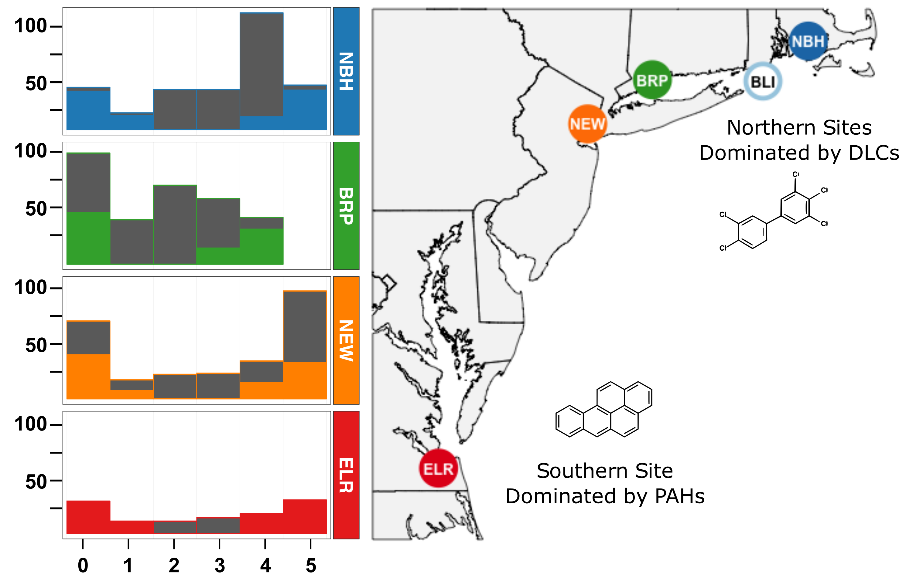
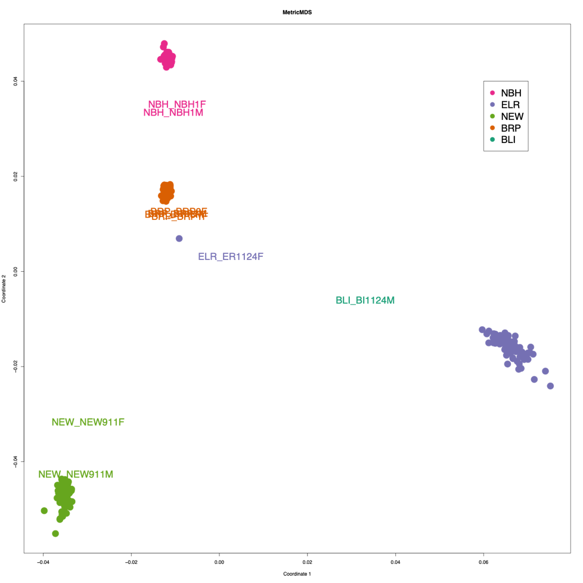
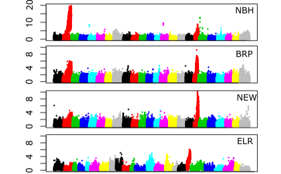
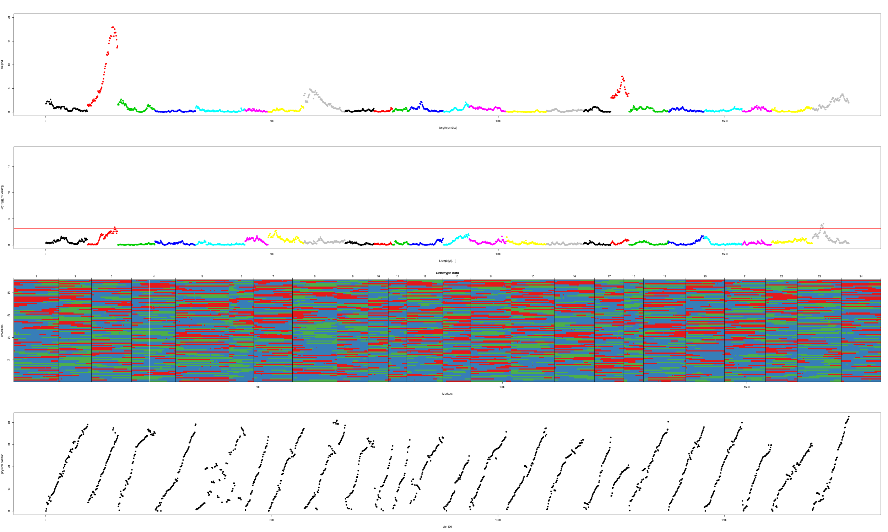
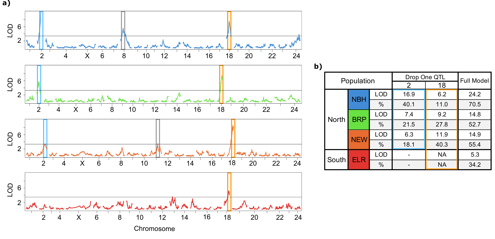
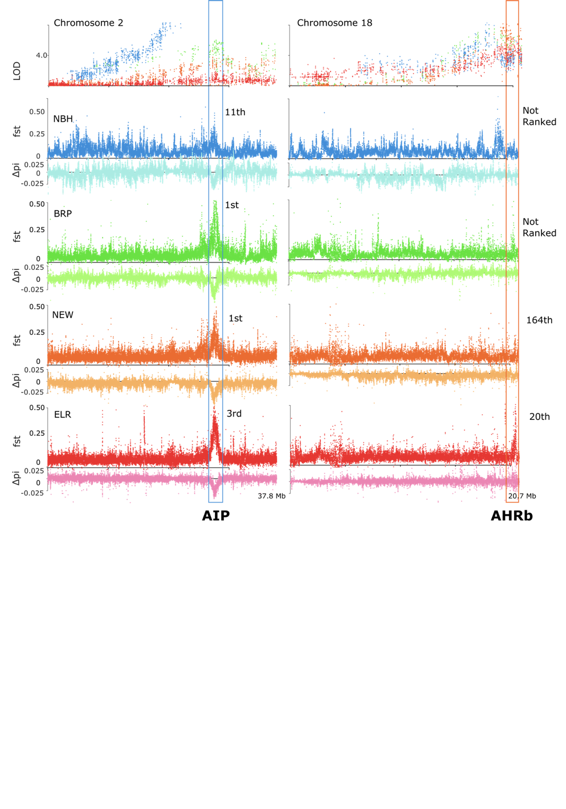

# killifish-RADseq-4popQTL

## Background :

Killifish (Fundulus heteroclitus and F. grandis) have rapidly and repeatedly evolved resistance to extreme pollution in urban estuaries of North America (Nacci et al. 2010; Oziolor et al. 2014) and we exploit this as a model system to unravel the genetic basis of adaptation to complex human-altered environments (e.g., (Whitehead et al. 2010, 2012; Reid et al. 2016; Oziolor et al. 2019)). Genome scans reveal many strong signatures of selection scattered throughout the genome; most are unique to each population that has evolved resistance, but the few loci that are shared tended to have the strongest signatures of selection and capture genes that control the aryl hydrocarbon receptor (AHR) signaling pathway (Reid et al. 2016; Oziolor et al. 2019). The AHR pathway is directly perturbed by dioxins and some polycyclic aromatic hydrocarbon (PAH) and polychlorinated biphenyl (PCB) pollutants, and this perturbation contributes to toxicity especially during embryolarval development (Clark et al. 2010). In the studies presented here, we seek to understand the genetic architecture that supports fitness in this extreme environment. We start by examining QTL that underlie resistance to PCB-126, a toxicant that is representative of a class of persistent toxic pollutants (dioxin-like chemicals; DLCs) that is ubiquitous in urban estuaries of North America. 

We created four QTL mapping families by breeding a female fish from each of four pollution-resistant populations with a male fish from a sensitive population. Embryos from F2 intercross families were challenged with PCB-126 exposure during development. Developing embryos were phenotyped for sensitivity by scoring the severity of PCB-induced cardiovascular system developmental defects, which are characteristic of PCB-126’s mechanism of toxicity. We then genotyped the ~48 most-resistant and ~48 most-sensitive individuals from each family. QTL analysis revealed a small set of loci that accounted for a large portion of phenotypic variation in each population (44% to 88%). Some QTL were shared among populations, whereas others were not. Most but not all QTL also showed strong signatures of selection in genome scans. These results highlight the importance of integrating quantitative and population genetic approaches to understand the genetic basis of adaptation, and offer a glimpse into the genetic architecture underlying rapid parallel adaptation to extreme pollution in urban killifish. 

Figure 1. We used balanced selective genotyping (or two-tail genotyping) (Lebowitz et al. 1987; Lander and Botstein 1989), where we selected ~48 individuals from each of the most sensitive and most resistant ends of the phenotypic distribution for each family. A) Locations of source populations for founders of mapping families. Sites are characterized by complex mixtures of pollutants but dominated by either polychlorinated biphenyls (PCBs) or TCDD in the three Northern sites (New Bedford Harbor, MA (NBH), Bridgeport Harbor, CT (BRP), and Newark, NJ (NEW)), or polycyclic aromatic hydrocarbons (PAHs) in the Southern site (Elizabeth River, VA (ELR)). All polluted site populations (filled circles) have been previously shown to be resistant to PCB-126. Open blue circle is the clean reference site (Block Island, RI (BI)) and source for the progenitor male for each of the mapping families. B) Bar graphs show the phenotypic distribution (developmental deformity index, x-axis) of embryos from each of the F2 intercross mapping families at 10 days after an exposure to a discriminating dose (200 ng/L in acetone) of PCB-126. Full bars show the total count of embryos collected and assigned a deformity score. Colored portion of each bar indicates the subset of embryos that were selected for genotyping.

Additional genotypes: In addition to genome-wide genotyping with RAD-seq, we also sought to confirm genotypes at two discrete loci: at the loci that encode aryl hydrocarbon receptor 2a/1a (AHR2a/1a) and aryl hydrocarbon receptor interacting protein (AIP). These loci encode proteins that are core components of the signaling pathway that is adaptively de-sensitized in resistant fish (Whitehead et al. 2012), and that show among the strongest signatures of natural selection in resistant populations (Reid et al. 2016). Since the adaptive haplotypes are not fixed in resistant populations (Reid et al. 2016), we sought to confirm whether adaptive haplotypes were segragating in our mapping families. We genotyped all ELR offspring for a deletion that spans the last exon of AHR2a and the first six exons of neighboring AHR1a (83 kb deletion) which exists at 81% frequency in wild ELR fish but is absent in sensitive fish from a nearby reference population (methods described in (Reid et al. 2016)). Two AIP non-synonymous SNPs at amino acid positions 224 and 252 were  genotyped in a subset of mapping family individuals (n=8 each family, 4 each sensitive/resistant, except for n=35  in ELR for SNP252,) and the founders of each cross.  We amplified a 1.4 kb genomic fragment with PCR primers AIP3F (5'- GGCGCTATACCCGCTCGTGTCC-3') and AIP5R2 (5'-CTTCATATTTGAAGACGAGGGAGG-3') using 10 ng genomic DNA and Advantage DNA polymerase (Clontech) with the following cycling conditions: [94oC, 1 min]; [94oC, 5 sec; 68oC, 2 min] 35 X; [68oC, 5 min]. The amplified product was direct-sequenced with the AIP5R2 primer for SNP analysis.

## Genotyping: 

I used RAD-seq (Miller et al. 2007) for genotyping these individuals from F2 intercross families and mapping family founders. I extracted from frozen embryos with a proteinase-K digestion and the Qiagen DNAeasy kit. Sequencing libraries were prepared for RAD-seq by ligating individual barcodes and NEBnext Illumina oligonucleotides to genomic DNA at SbfI cut sites. Four lanes of paired-end (PE-100) sequence data (Illumina HiSeq 2500) were collected (one lane per plate of 96 samples) to enable genotyping of offspring and founders at RAD sites. After I de-multiplexing by barcode (perl script authored by Mike Miller, UC Davis) [link](code/seq/BarcodeSplitListBestRadPairedEnd.pl) and evaluatied the quality of each sample with FASTQC, I aligned reads to a linkage-mapped Fundulus heteroclitus assembly ((Miller et al. 2019); EBI BioStudies accession S-BSST163; this map orders scaffolds from the Fundulus heteroclitus reference genome assembly Fundulus_heteroclitus-3.0.2, NCBI BioProject PRJNA177717). I assigned read group information and aligned reads with BWA-MEM using default parameters, marked duplicates with SAMBLASTER, sorted reads with SAMTOOLS, and flagged improperly paired reads with BAMTOOLS (Barnett et al. 2011; Faust and Hall 2014).[link](code/seq/02_array.align.sh) I then used Freebayes to call genotypes on all mapping populations simultaneously (Garrison 2018). [link](code/seq/freebayes.array.sh) I clustered sample genotypes with metric MDS for QAQC and to cluster genotypes at chromosome 5 to assign sex to the immature embryos to include sex as a covariate in the QTL search and model fit (Figure 2). 

Figure 2. Metric MDS on un-filtered SNPs. Sample ID was checked by clustering individuals with metric MDS and PLINKS relationship/covariance Identity-by-state calculation engine on marker data. Colored dots represent embryos from F2 intercross families. Colored text represent progenitors of mapping families. Clustering is largely driven by sharing more common markers in the offspring, which causes grand-parents to not cluster as tightly even though they are related to offspring as much as they are to one another. I found that one grandparent of ELR was an incorrectly barcoded offspring sample.

I filtered for bi-alleleic SNPs, repetitive sequence alignments, family-specific invariant sites and split families into separate datasets with PLINK 1.9 (Chang et al. 2015). [link](code/seq/04_process.variants.sh) (cleanup) I formatted the genotypes for each mapping family to be loaded as independent crosses for QTL analysis in R/qtl (Broman et al. 2003). [web](https://rqtl.org),[git](https://github.com/kbroman/qtl),[cran](https://cran.r-project.org/web/packages/qtl/index.html) In R/qtl, offspring genotypes were filtered based on the number of genotypes per locus (>12.5% missing data) and the level of segregation distortion (p<0.001) from a 1:2:1 ratio following R/qtl recommendations (Broman and Sen 2009)[link](code/map/R/maps/01_NBH_filter.R). Outcrosses in R/qtl are assumed to be from inbred founders, so I limited our analysis to markers that were homozygous for alternate alleles in the founders (double heterozygotes in F1 parents). Our segregation distortion filter was conservative because selective genotyping is expected to lead to some distortion, particularly at QTL of large effect (Xu 2008).  After filtration, markers that were genotyped in the founders and F2 embryos were assigned to a consistent allele (A or B) within and among linkage groups. Any markers that I could not confirm with founder genotypes were filtered to those that were clearly linked with other markers in the linkage group (formLinkageGroups in R/qtl with a recombination frequency < 0.1 and LOD score of 10). I initially anchored markers to their physical position along chromosomes, but then used recombination frequency to reorder (assign a different order than the initial meiotic map) markers and estimated mapping distance in this order with the Kosambi mapping algorithm (Kosambi 1943). Differences from the initial meiotic map may be the result of genome structual variation within a mapping population or read mapping and genome assembly errors. I then checked whether the final filtered marker set sufficiently covered the reference genome physical map and provided a sensible mapping order by visualizing the pairwise recombination frequency and LOD linkage matrix for each chromosome, as well as the relationship between genetic and physical distances along chromosomes (Figure 4). After filtering, the number of markers remaining for mapping were: 1,763 for the NBH family, 3,361 for the BRP family, 6,690 for the NEW family, and 10,388 for the ELR family. The genotypes at the AHR2a/1a locus (presence/absence of a deletion) were added to the QTL analysis with RAD-Tag markers to test for linkage with other chromosomal markers and for an association with the resistant phenotype. 

## QTL analysis:

Figure 3. LOD score (y-axis) of genotype by phenotype regression (binary trait) of unfiltered RAD-TAG genotypes for each population on chromsomes 1-24 (colors along x-axis). Unfiltered genotypes mapped to physical locations indicate a common locus in all four populations.

After filtering down to a mangagable number of markers (rQTL stores all markers in memory), I performed most of the QTL analysis and model building in interactive R sessions [link](code/map/R/qtls/02_scans_NBH.R). Prior to interval mapping, I performed a marker regression on un-filtered markers to set the priors for exploring QTL model-space for interval mapping (Figure 3). I refined markers by iteratevly visualizing LOD of markers, offpring genotypes, and physical position of snps for each population to ensure that I had informative markers along each chromosome. I then performed interval mapping on the filtered markers in R/qtl to test the single QTL model on each chromosome via multiple imputation (n=500) and Haley-Knott regression, which estimates the most likely interval genotypes and QTL position between RAD markers from the log posterior distribution. If the LOD score for the single QTL test exceeded our permuted threshold (top 15% of the null distribution) in a single QTL scan, the position of the highest LOD score was added to the full QTL model.  

Figure 4. Example of diagnostic plotting (NBH population) I performed during marker selection and mapping. Top row is LOD score (y-axis) for markers on each chromosome (x-axis) associated with resistance to PCB-126. Linkage is high in our mapping populations, so true QTL peaks are expected to be wide (mb scale). The second row is imputed genotypes of 96 offspring for NBH. I visualized genotypes to identify genotyping errors, and change these genotypes to missing. The bottom row is physical position of markers (y-axis) against final order (x-axis) of mapped markers. Side note: Physical position and order should have a linear relationship, except when 'micro-inversions' are observed. This is evidence of a true inversion in a population, or, a mis-assembly in the referece genome where a contig/scaffold was placed in the wrong direction. Both observations indicate that these are quality markers to map the phenotype. 

I compared multiple single and full-QTL models between methods (normal, binary, transformed data with parametric and non-parametric models). I examined models that included only the initial two major QTL discovered by marker regression (including the addition of the large effect QTL as cofactors for scanning for additional QTL), as well as more inclusive models that included the minor effect QTL in the full-model that were discovered by single QTL scans. QTL were dropped if they did not significantly change the fit of the full-model in the drop-one-qtl analysis. The full model in R/qtl estimated the additive and dominance effect of each of the QTL in the model. I compared their relative effect sizes to illuminate the genetic architecture of resistance in each of the mapping families.

Figure 5. QTL and their contribution to variation in sensitivity to PCB-induced toxicity. a) LOD score results along each chromosome (x-axis numbers) for single QTL scans of RAD-Tag markers in each mapping family. Tall colored boxes (blue and gold) unite the QTL that fall on the same chromosome/position in multiple families. Grey boxes indicate different minor-effect QTL that explain a small proportion of the resistance phenotype and tend to not be shared between crosses. b) Summary of the contribution (drop one QTL analysis) of large-effect QTL (blue and gold boxes) to the full QTL model (LOD and percent variance explained) in each mapping family. 

## Selection Scan Data:
To further refine my QTL to candidate genes that contribute to resistance, I intersected previously identified signatures of selection from population genomics studies (Reid et al. 2016) with the QTL identified here by aligning both datasets to the same chromosomal coordinates. This approach has been effective for connecting QTLs to strong selection from domestication and breeding (Rubin et al. 2012). Signatures of selection were identified from whole-genome scans of diversity and divergence between each of the four resistant populations and nearby non-resistant populations (not performed by me or code in this repo)(Reid et al. 2016). In the population genomics studies, genomic scaffolds were scanned for extreme values of pi, Fst, and Tajimas D in 5kb windows to identify signatures of strong recent natural selection. The selection signature thresholds for each statistic were set using a demographic model to simulate a null distribution of each statistic. These thresholds were used to convert the statistics into an aggregate z-score. The Z-scores (which included the width and mangnitude of the signature region) formed a composite rank for each signature of selection in each polluted population. Fst, delta pi, and composite ranks on the scaffold level genome assembly were lifted over to a physical position on the killifish chromosomal assembly [link](code/seq/liftover-popgen.sh) (Miller et al. 2016, Fundulus_heteroclitus-3.0.2, NCBI BioProject PRJNA177717) with liftover using a chain-file generated by ALLMAPS (Hinrichs et al. 2006; Tang et al. 2015).[link](https://github.com/tanghaibao/jcvi) QTL intervals were evaluated against the 50 and 200 top-ranked composite signatures of selection from (Reid et al. 2016). 

Figure 6. Large-effect QTL (first row) on CHR2 (left column) and CHR18 (right column) aligned with signatures of selection from genome scans for each resistant population (remaining rows). X-axis tick marks represent Mb intervals along the two chromosomes. QTL LOD scores (top row) are the results from a single-QTL scan (marker regression) in each of the QTL mapping families (the blue series represents LOD scores from NBH mapping families, green from BRP, orange from NEW, and red from ELR). Panels in the remaining rows include Fst and delta pi between each of the resistant populations and their nearby reference populations (original genome scan data were collected by (Reid et al. 2016)). Elevated Fst and reduced delta pi are signatures of recent strong natural selection. Tall boxes highlight the position and rank of the top-ranked signatures of selection that co-localize to a large-effect QTL. The large effect QTL on CHR2 (which contains AIP) coincides with a highly-ranked selection signature region; though this region shows a strong signature of selection in all four populations, it includes a QTL for only three of the populations (NBH, BRP, and NEW). The large effect QTL on chromosome 18 (which contains AHR1b and AHR2b) is found in all four populations, but coincides with highly-ranked selection signature regions in only two of those populations (ELR and NEW).

## References

Barnett, D. W., E. K. Garrison, A. R. Quinlan, M. P. Stromberg, and G. T. Marth. 2011. BamTools: a C++ API and toolkit for analyzing and managing BAM files. Bioinformatics 27:1691–1692.

Broman, K. W., H. Wu, S. Sen, and G. A. Churchill. 2003. R/qtl: QTL mapping in experimental crosses. Bioinformatics 19:889–890.

Broman, K. W., and S. Sen. 2009. A guide to QTL mapping with R/qtl. Springer, Dordrecht.

Chang, C. C., C. C. Chow, L. C. Tellier, S. Vattikuti, S. M. Purcell, and J. J. Lee. 2015. Second-generation PLINK: rising to the challenge of larger and richer datasets. Gigascience 4.

Faust, G. G., and I. M. Hall. 2014. SAMBLASTER: Fast duplicate marking and structural variant read extraction. Pp. 2503–2505 in Bioinformatics.

Garrison, E. 2018. freebayes: Bayesian haplotype-based genetic polymorphism discovery and genotyping.

Kosambi, D. D. 1943. The estimation of map distances from recombination values. Annals of Eugenics 12:172–175.

Miller, J. T., N. M. Reid, D. E. Nacci, and A. Whitehead. 2019. Developing a High-Quality Linkage Map for the Atlantic Killifish Fundulus heteroclitus. G3 9:2851–2862.

Miller, M. R., J. P. Dunham, A. Amores, W. A. Cresko, and E. A. Johnson. 2007. Rapid and cost-effective polymorphism identification and genotyping using restriction site associated DNA (RAD) markers. Genome Research 17:240–248.

Reid, N. M., D. A. Proestou, B. W. Clark, W. C. Warren, J. K. Colbourne, J. R. Shaw, S. I. Karchner, M. E. Hahn, D. Nacci, M. F. Oleksiak, D. L. Crawford, and A. Whitehead. 2016. The genomic landscape of rapid repeated evolutionary adaptation to toxic pollution in wild fish. Science 354:1305–1308.

Whitehead, A., W. Pilcher, D. Champlin, and D. Nacci. 2012. Common mechanism underlies repeated evolution of extreme pollution tolerance. P Roy Soc B-Biol Sci 279:427–433.

Xu, S. 2008. Quantitative Trait Locus Mapping Can Benefit From Segregation Distortion. Genetics 180:2201–2208. Genetics.